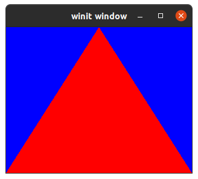

# Cross-Platform Renderer

A cross platform renderer using wgpu, written in rust. A proof of concept to compile and run on desktop, mobile and the web in one project. 

## Current status

| Platform | Compilation        | BG Clear           | Triangle           |
| -------- | ------------------ | ------------------ | ------------------ |
| Desktop  | :heavy_check_mark: | :heavy_check_mark: | :heavy_check_mark: |
| Web      | :heavy_check_mark: | :heavy_check_mark: | :heavy_check_mark: |
| Android  | :heavy_check_mark: | :heavy_check_mark: | :heavy_check_mark: |

## Requirements

For desktop platforms nothing special aside from the standard rust toolchain is needed.

### Android

Install AndroidSDK and NDK and setup environment variables (`ANDROID_SDK_ROOT` and `ANDROID_NDK_ROOT`).

Install cargo-apk with `cargo install cargo-apk`.

Add desired android targets with `rustup target add <triple>`.

### Web

Install trunk with `cargo install trunk`

Add wasm target with `rustup target add wasm32-unknown-unknown`

## Build instructions

### Desktop

Run `cargo run`. By default the desktop crate is build.

### Android

Run `cargo apk run -p android-build` optionally with the flag `--target <triple>` for explicit target selection.

### Web

Run `cd bin/web/`

Run `trunk serve`

Trunk is now serving app under `http://localhost:8080`
